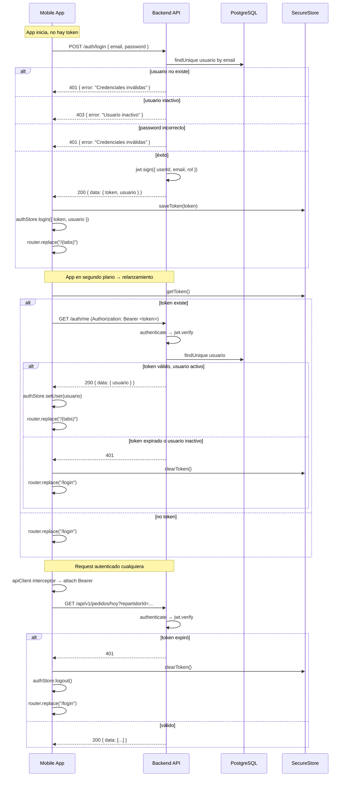

# Flujo de Autenticación

## Componentes involucrados

| Capa | Archivo | Rol |
|---|---|---|
| Backend | `features/auth/service.ts` | Login, getMe, updateMe |
| Backend | `middleware/auth.middleware.ts` | authenticate + requireRole |
| Backend | `config/env.ts` | jwtSecret, jwtExpiresIn |
| Mobile | `features/auth/services/authStorage.ts` | getToken / saveToken / clearToken (SecureStore) |
| Mobile | `stores/authStore.ts` | Estado global de sesión (Zustand) |
| Mobile | `app/_layout.tsx` | Auth gate (bootstrap) |
| Mobile | `hooks/useLogin.ts` | useMutation para login |
| Mobile | `services/api.ts` | interceptors (attach JWT + 401 → logout) |

## Mock Credenciales

| Usuario | Email | Password |
|---|---|---|
| Repartidor | `repartidor@supplycycle.com` | `Repartidor123` |
| Admin | `admin@supplycycle.com` | `Admin1234` |
