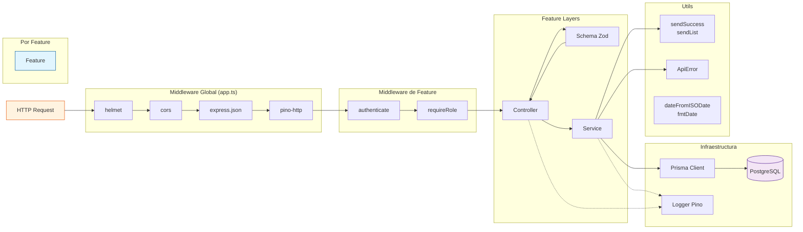

# Arquitectura del Backend



## Flujo de una request

1. **Middleware global**: `helmet` (seguridad HTTP) → `cors` → `express.json` → `pino-http` (logging)
2. **Autenticación**: `authenticate` verifica JWT (o lanza 401) → `requireRole` verifica rol (o lanza 403)
3. **Controller**: recibe `req.user`, valida body con Zod, llama al service
4. **Service**: orquesta la lógica de negocio, usa Prisma para DB, lanza `ApiError` si algo falla
5. **Response**: `sendSuccess`/`sendList` envuelve en `{ data: ... }` (formato ADR-0000)
6. **Error**: si ocurre `ZodError` o `ApiError`, el `errorHandler` global lo captura y responde con el formato estándar

## Estructura de una feature

```
src/features/<feature>/
├── controller.ts   # Handlers Express (req → service → res)
├── service.ts      # Lógica de negocio + Prisma
├── routes.ts       # Router con middleware y versionado
├── schema.ts       # Schemas Zod para validación
├── types.ts        # Tipos específicos (opcional)
└── __tests__/      # Tests unitarios (Vitest)
```

## Features actuales

| Feature | Endpoints | Archivos |
|---|---|---|
| `auth` | POST `/login`, GET `/me`, PATCH `/me` | 7 (2 test) |
| `clientes` | CRUD completo | 6 (2 test) |
| `items` | GET list, GET by id (solo lectura) | 4 (sin test) |
| `pedidos` | CRUD + estados + items del pedido | 5 (1 test) |
| `repartos` | CRUD + carga + estado + admin | 4 (sin test) |
| `usuarios` | CRUD admin (excepto self) | 6 (1 test) |
