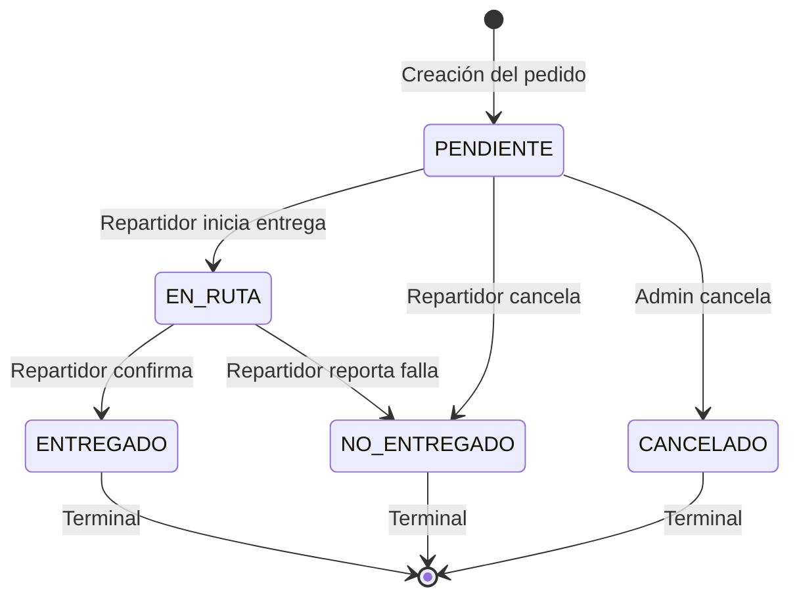

# Máquina de Estados — Pedido

## Transiciones válidas (código)

| Desde | Hacia | Acción | ¿Quién? |
|---|---|---|---|
| `PENDIENTE` | `EN_RUTA` | `PATCH /pedidos/:id/estado { estado: "EN_RUTA" }` | Repartidor |
| `PENDIENTE` | `NO_ENTREGADO` | `PATCH /pedidos/:id/cancelar { motivo }` | Repartidor |
| `PENDIENTE` | `CANCELADO` | `POST /pedidos/:id/cancelar` | Admin |
| `PENDIENTE` | `ENTREGADO` | `PATCH /pedidos/:id/confirmar` | Repartidor ⚠️ |
| `EN_RUTA` | `ENTREGADO` | `PATCH /pedidos/:id/confirmar` | Repartidor |
| `EN_RUTA` | `NO_ENTREGADO` | `PATCH /pedidos/:id/cancelar { motivo }` | Repartidor |

> **⚠️ Inconsistencia detectada**: `confirmarEntrega()` permite `PENDIENTE → ENTREGADO`, pero la máquina de estados `TRANSICIONES` en `pedidos/service.ts:19` no lo contempla. Esto puede ser intencional (flexibilidad para el repartidor) o un bug.

## Auto-completar Reparto

Cuando un pedido llega a `ENTREGADO`, `NO_ENTREGADO` o `CANCELADO`, se dispara `autoCompletarRepartoSiCorresponde()`. Si todos los pedidos del reparto están en estado terminal, el reparto se marca como `COMPLETADO`.
