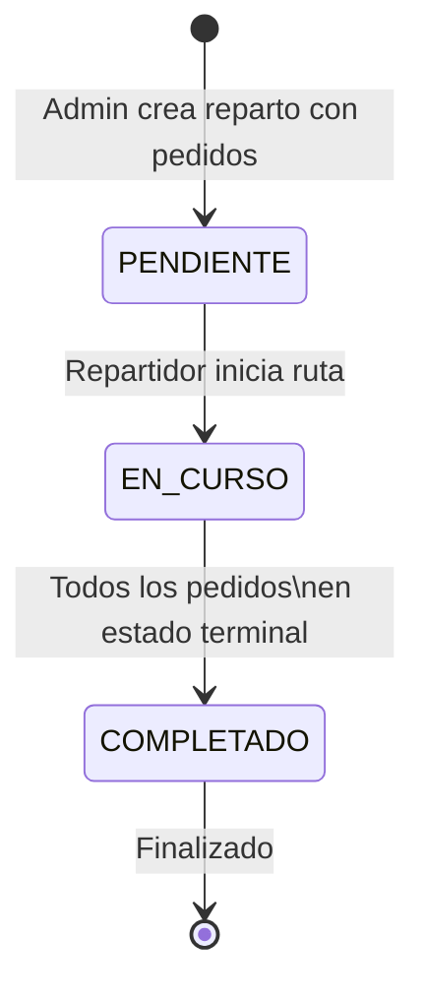

# Máquina de Estados — Reparto

## Reglas de transición

| Desde | Hacia | Condición | Código |
|---|---|---|---|
| `PENDIENTE` | `EN_CURSO` | No hay otro reparto `EN_CURSO` para el mismo repartidor | `repartos/service.ts:523` |
| `EN_CURSO` | `COMPLETADO` | Todos los pedidos están en estado terminal (`ENTREGADO`, `NO_ENTREGADO`, `CANCELADO`) | `pedidos/service.ts:251` |
| `EN_CURSO` | `EN_CURSO` | ❌ Rechazado (idempotente) | `repartos/service.ts:518` |
| `COMPLETADO` | cualquier | ❌ Rechazado (no retroceder) | `repartos/service.ts:514` |

## Auto-completar automático

El reparto se completa automáticamente cuando el último pedido cambia a estado terminal, vía `autoCompletarRepartoSiCorresponde()` en `pedidos/service.ts:236`. No requiere acción del repartidor ni del admin.

## Horarios

- `horaInicio` se setea al pasar a `EN_CURSO`
- `horaFin` se setea al pasar a `COMPLETADO`
- Formato: `HH:mm` (hora local Argentina)
